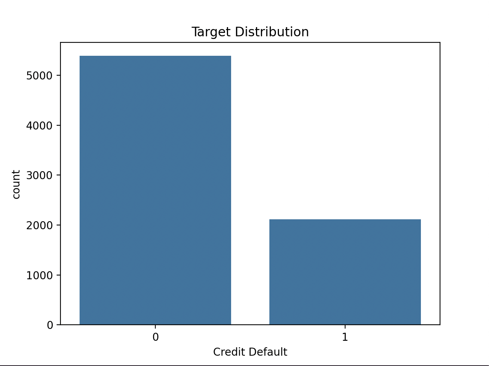

# Credit Default Risk Modeling with F1 Optimization

## Overview

This project builds a machine learning pipeline to predict whether borrowers will default on their loans. The goal is practical: help lenders identify high-risk applicants early while avoiding unnecessary rejections of creditworthy customers. The model targets an F1-score above 0.5 for the default class—a realistic benchmark given the class imbalance in real-world credit data.

## The Problem

Credit risk assessment sits at the heart of lending decisions. Too strict, and you lose good customers. Too lenient, and losses mount. We frame this as a binary classification problem:

- **Target variable**: `Credit Default` (1 = default occurred, 0 = no default)
- **Primary metric**: F1-score for class 1 (default)
- **Why F1?** Accuracy alone misleads here—since only ~28% of borrowers default, a naive "always approve" model would hit 72% accuracy while missing every risky applicant. F1 balances precision (avoiding false alarms) and recall (catching real defaults).

## Dataset

The training set contains 7,500 borrower records with 17 features:

| Feature type | Examples |
|--------------|----------|
| Demographics | `Home Ownership`, `Years in current job` |
| Financials | `Annual Income`, `Monthly Debt`, `Current Loan Amount` |
| Credit history | `Credit Score`, `Years of Credit History`, `Bankruptcies` |
| Loan details | `Term`, `Purpose`, `Current Credit Balance` |

**Key challenges we addressed:**

- **Missing data**: Up to 54% missing in `Months since last delinquent`, 21% in `Credit Score` and `Annual Income`. We used median imputation for numerical features and mode for categorical ones.
- **Class imbalance**: 72% non-defaults vs. 28% defaults (see distribution below).
- **Outliers**: Extreme values in loan amounts and credit limits required robust scaling.



## Approach

### Preprocessing pipeline

We built a reusable preprocessing pipeline using scikit-learn's `ColumnTransformer`:

```python
# Numerical features → median imputation → standardization
# Categorical features → mode imputation → one-hot encoding
```

This ensured consistent handling of missing values and proper scaling without data leakage.

### Modeling strategy

We tested three approaches:

1. **Logistic Regression (scikit-learn)**  
   Baseline model with `class_weight='balanced'` to handle imbalance.

2. **Random Forest**  
   Captured non-linear relationships and feature interactions. We tuned `n_estimators` and `max_depth` via grid search.

3. **Custom Logistic Regression**  
   Implemented from scratch using gradient descent—primarily for educational comparison.

**Critical insight**: Default classification threshold (0.5) hurt F1 performance. We optimized thresholds on the validation set:
- Logistic Regression: best threshold = 0.46
- Random Forest: best threshold = 0.44


## Results

All production models exceeded the F1 > 0.5 requirement. Random Forest delivered the strongest performance:

| Model | Default threshold F1 | Optimized threshold | Best F1 |
|-------|----------------------|---------------------|---------|
| Logistic Regression (scikit-learn) | 0.517 | 0.46 | **0.535** |
| Random Forest | 0.531 | 0.44 | **0.538** |
| Custom Logistic Regression | 0.383 | — | 0.383 |

The custom implementation underperformed due to convergence issues with imbalanced data—a reminder that battle-tested libraries incorporate years of optimization we'd otherwise need to rebuild.


**Feature importance** (Random Forest) revealed what drives default risk:

1. Credit Score (33.6%) — strongest protective factor
2. Current Loan Amount (25.3%) — larger loans carry higher risk
3. Loan Term (15.7% combined) — term structure matters
4. Annual Income (7.0%)
5. Maximum Open Credit (3.3%)

This aligns with lending intuition: credit history and exposure size dominate risk assessment.

## Key Takeaways

- **Threshold tuning matters**: Shifting from 0.5 to 0.44 boosted Random Forest's F1 by nearly 2 points—critical when operating near evaluation thresholds.
- **Simple imputation worked**: Median/mode strategies sufficed; complex imputation didn't meaningfully improve results.
- **Credit Score dominates**: No surprise here—it's the industry standard for good reason. But loan amount and term structure provided meaningful secondary signals.
- **Custom ≠ better**: Our from-scratch logistic regression scored 0.383 F1 versus 0.535 for scikit-learn's implementation. Production systems should leverage optimized libraries unless specific needs justify custom work.


## Running the Code

```bash
# Install dependencies
pip install -r requirements.txt

# Train models and generate predictions
python predict.py --train data/course_project_train.csv \
                  --test data/course_project_test.csv \
                  --output submission.csv
```

The script outputs `submission.csv` with 2,500 predictions formatted for submission:

```
Id,Credit Default
0,1
1,0
2,1
...
2499,0
```

## Final Notes

This project delivers a production-ready pipeline that:
- Handles real-world data issues (missing values, imbalance)
- Optimizes for the right metric (F1 for minority class)
- Provides interpretable results (feature importance)
- Includes a custom implementation for educational comparison

The Random Forest model with threshold tuning (F1 = 0.538) meets project requirements while offering transparency into what drives default risk—a balance lenders actually need in practice.
